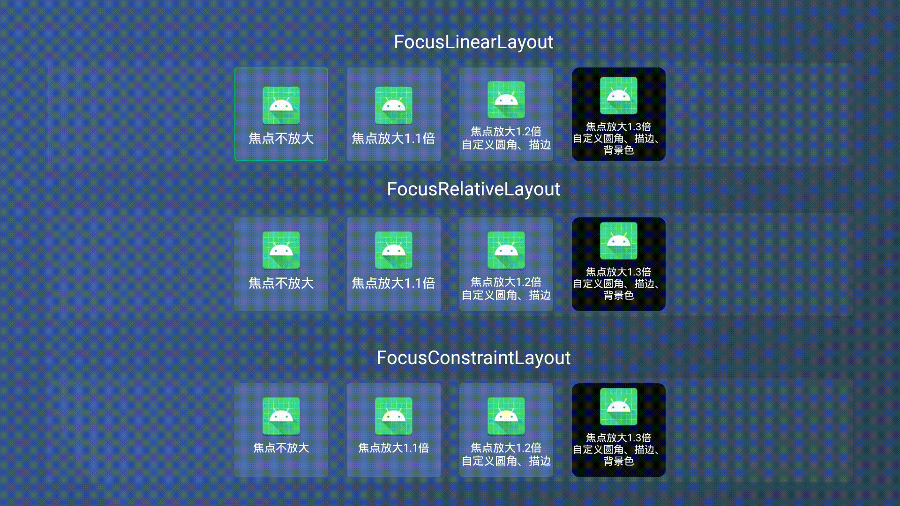

# AndroioTvFocusLayer

一个针对安卓TV开发中 View 获取焦点时进行放大变色的通用库。

**博客地址：**

https://towerye.github.io/2020/03/25/TvFocusLayer/#more

**效果图：**

用的 Android Studio 的 TV 虚拟机录制的，有点卡，在小米，天猫盒子上试过是不会出现这种卡顿的效果的。



## 一、前言

&emsp;&emsp;最近在负责一款 Android TV 的项目，由于是第一次接触电视端的项目，最开始是打算直接采用谷歌官方的 [Leanback](https://developer.android.com/training/tv?hl=zh-cn) 那套框架来开发，但是由于相关 UI 过于封闭，不易自定义，所以就放弃了。电视端相较于手机端的 APP，最大的区别就是交互方式，电视端不能像手机 APP 那样直接通过触碰点击，而必须要通过遥控器去交互，这就涉及到电视端的相关控件的焦点问题。

&emsp;&emsp;在电视或一些电视盒子上，通常 View 在获取焦点时就会有个放大的效果，同时会有一个边框，以此来提示用户这个 View 是当前被选中的 View，为了实现这个效果，最开始在网上搜了下，发现都比较复杂，大部分都是在自定义 View 通过 Paint 那一套来自己画啊什么的，我嫌麻烦，最后就自己用相对简单的方式来实现，主要就是通过实现 `OnFocusChangeListener` 监听器来获取焦点变化状态，再在布局文件中通过 `clipChildren` 以及 `clipToPadding` 两个属性来让控件可以超出父布局来进行绘制，再动态创建不同焦点下的 `Shape` 图形，以此来达到最终的目的。

## 二、属性介绍

| 名称 | 类型 | 说明 |
| --- | --- | --- |
| isScale | boolean | 获取焦点后是否放大 |
| scaleSize | float | 获取焦点后需放大的倍数 |
| layerRadius | float | 圆角大小 |
| contentBgColor | int | 内容背景色 |
| focusContentBgColor | int | 获取焦点时内容背景色 |
| focusStrokeColor | int | 获取焦点时的边框颜色 |
| focusStrokeWidth | int | 获取焦点时的边框的宽度 |

## 三、具体使用

&emsp;&emsp;对布局中常用的 `LinearLayout`，`RelativeLayout`,`ConstraintLayout` 进行了重新封装，可根据自己的习惯引入对应的 layout 进行布局，具体对应关系如下：

| 原生 Layer | 焦点 Layer |
| --- | --- |
| LinearLayout | FocusLinearLayout |
| RelativeLayout | FocusRelativeLayout |
| ConstraintLayout | FocusConstraintLayout |

&emsp;&emsp;具体使用如下：

**FocusLinearLayout**

```xml
<com.tt.focuslayer.widget.FocusLinearLayout
            android:layout_width="100dp"
            android:layout_height="100dp"
            android:layout_marginStart="20dp"
            android:gravity="center"
            android:orientation="vertical"
            focus:contentBgColor="@color/black_80"
            focus:focusContentBgColor="@color/green"
            focus:focusStrokeColor="@color/white_60"
            focus:focusStrokeWidth="3"
            focus:layerRadius="8"
            focus:scaleSize="1.3">

            .
            .
            .

</com.tt.focuslayer.widget.FocusLinearLayout>
```

**FocusRelativeLayout**

```xml
 <com.tt.focuslayer.widget.FocusRelativeLayout
            android:layout_width="100dp"
            android:layout_height="100dp"
            android:layout_marginStart="20dp"
            android:layout_toEndOf="@+id/layer2"
            focus:focusStrokeColor="@color/colorPrimary"
            focus:focusStrokeWidth="2"
            focus:layerRadius="4"
            focus:scaleSize="1.2">

            .
            .
            .

</com.tt.focuslayer.widget.FocusRelativeLayout>
```

**FocusConstraintLayout**

```xml
 <com.tt.focuslayer.widget.FocusConstraintLayout
            android:layout_width="100dp"
            android:layout_height="100dp"
            app:layout_constraintBottom_toBottomOf="parent"
            app:layout_constraintEnd_toStartOf="@+id/layer2"
            app:layout_constraintStart_toStartOf="parent"
            app:layout_constraintTop_toTopOf="parent"
            focus:isScale="false">

            .
            .
            .

</com.tt.focuslayer.widget.FocusConstraintLayout>
```

&emsp;&emsp;如果相应的 layer 在获取焦点放大时，View 被裁切没有显示完整，此时需要在布局文件的根 View 中加上如下的代码：

```xml
<androidx.constraintlayout.widget.ConstraintLayout
    xmlns:android="http://schemas.android.com/apk/res/android"
    xmlns:app="http://schemas.android.com/apk/res-auto"
    xmlns:focus="http://schemas.android.com/apk/res-auto"
    android:layout_width="match_parent"
    android:layout_height="match_parent"
    android:clipChildren="false"
    android:clipToPadding="false">
```

&emsp;&emsp;核心代码就是

```xml
android:clipChildren="false"
android:clipToPadding="false"
```

&emsp;&emsp;这二者的作用就是允许子 View 在进行绘制的时候是否可以超出父布局的边界进行绘制，默认是不允许的，所以没加该代码时，会导致 View 在获取焦点放大时被裁切以致显示不完整。

&emsp;&emsp;相关源码注释：

```
<!-- Defines whether a child is  limited to draw inside of its bounds or not.
             This is useful with animations that scale the size of the children to more
             than 100% for instance. In such a case, this property should be set to false
             to allow the children to draw outside of their bounds. The default value of
             this property is true. -->

<attr name="clipChildren" format="boolean" />

<!-- Defines whether the ViewGroup will clip its children and resize (but not clip) any
             EdgeEffect to its padding, if padding is not zero. This property is set to true by
             default. -->

<attr name="clipToPadding" format="boolean" />
```

## 四、实现原理

&emsp;&emsp;在开发中经常会涉及到这种业务，一个按钮，在选中时和未选中会呈现不同的颜色样式，这种情况，通过都会创建一个 selector 的 xml 文件并通过 `Shape` 来设置不同状态下的相关样式，比如：

```xml
<?xml version="1.0" encoding="utf-8"?>
<selector xmlns:android="http://schemas.android.com/apk/res/android">

    <!--获取焦点时-->
    <item android:state_focused="true">
        <shape>
            <corners android:radius="3dp" />
            <stroke android:width="1dp" android:color="@color/white" />
            <solid android:color="@color/black" />
        </shape>
    </item>
    
    <!--常规状态时-->
    <item>
        <shape>
            <solid android:color="@color/red" />
            <corners android:radius="3dp" />
        </shape>
    </item>
</selector>
```

&emsp;&emsp;顺着这个思路，若需要根据自定义属性来进行 View 焦点变化时的样式改变，只需动态创建一个类似 selector 的图片即可，刚好 Android 是有提供的，即：[StateListDrawable](https://developer.android.com/reference/android/graphics/drawable/StateListDrawable) 和 [GradientDrawable](https://developer.android.com/reference/android/graphics/drawable/GradientDrawable)，具体介绍可以参考官方文档。顺着这个思路，就可以根据传进来的自定义属性，把相关的值设置到对应的Drawable中去，再结合 `OnFocusChangeListener` 进行焦点变化的控制，下面以 `FocusLinearLayout` 来说明：

```kotlin
package com.tt.focuslayer.widget

import android.content.Context
import android.graphics.Color
import android.graphics.drawable.GradientDrawable
import android.graphics.drawable.StateListDrawable
import android.util.AttributeSet
import android.view.View
import android.widget.LinearLayout
import androidx.core.view.ViewCompat
import com.tt.focuslayer.R
import com.tt.focuslayer.util.dp2px

/**
 * @Author tt
 * @Date 2020/2/27-17:00
 */
class FocusLinearLayout
@JvmOverloads constructor(context: Context,
                          attrs: AttributeSet? = null,
                          defStyleAttr: Int = 0) : LinearLayout(context, attrs, defStyleAttr),
                                                   View.OnFocusChangeListener {
    /**
     * 获取焦点后是否放大
     */
    private var isScale: Boolean = false
    /**
     * 获取焦点后需放大的倍数
     */
    private var scaleSize: Float = 1.1f
    /**
     * 圆角
     */
    private var cornerRadius: Float = 0f
    /**
     * 内容背景色
     */
    private var contentBgColor: Int = 0
    /**
     * 获取焦点时内容背景色
     */
    private var focusContentBgColor: Int = 0
    /**
     * 获取焦点时的边框颜色
     */
    private var focusStrokeColor: Int = 0
    /**
     * 获取焦点时的边框的宽度
     */
    private var focusStrokeWidth: Int = 0

    init {
        if (attrs != null) {
            val attributes = context.obtainStyledAttributes(attrs, R.styleable.FocusLayer)
            isScale = attributes.getBoolean(R.styleable.FocusLayer_isScale, true)
            scaleSize = attributes.getFloat(R.styleable.FocusLayer_scaleSize, 1.1f)
            cornerRadius =
                    attributes.getFloat(R.styleable.FocusLayer_layerRadius, 3f)
            contentBgColor =
                    attributes.getColor(R.styleable.FocusLayer_contentBgColor, Color.parseColor("#4F6D9A"))
            focusContentBgColor =
                    attributes.getColor(R.styleable.FocusLayer_focusContentBgColor, 0)
            focusStrokeColor =
                    attributes.getColor(R.styleable.FocusLayer_focusStrokeColor, Color.parseColor("#00BC71"))
            focusStrokeWidth =
                    attributes.getInt(R.styleable.FocusLayer_focusStrokeWidth, 1)
            attributes.recycle()
        }

        val stateListDrawable = StateListDrawable()
        // 未获取焦点时显示的样式
        val normalDrawable = GradientDrawable()
        // 设置 <corners android:radius/>
        normalDrawable.cornerRadius = dp2px(cornerRadius).toFloat()
        // 设置 <solid android:color/>
        normalDrawable.setColor(contentBgColor)

        // 获取焦点时显示的样式
        val focusDrawable = GradientDrawable()
        focusDrawable.cornerRadius = dp2px(cornerRadius).toFloat()
        focusDrawable.setColor(if (focusContentBgColor != 0) focusContentBgColor else contentBgColor)
        // 设置 <stroke android:width android:color />
        focusDrawable.setStroke(dp2px(focusStrokeWidth), focusStrokeColor)
        
        // 将焦点状态的 GradientDrawable 绑定到 StateListDrawable 中
        // intArrayOf(android.R.attr.state_focused)表示：state_focused = "true"
        stateListDrawable.addState(intArrayOf(android.R.attr.state_focused), focusDrawable)
        
        // 将未获取焦点状态的 GradientDrawable 绑定到 StateListDrawable 中
        // intArrayOf()表示常规状态
        stateListDrawable.addState(intArrayOf(), normalDrawable)

        this.onFocusChangeListener = this
        this.background = stateListDrawable
        this.isFocusable = true
    }

    override fun onFocusChange(v: View?, hasFocus: Boolean) {
        if (v == null) {
            return
        }

        if (hasFocus && isScale) {
            // 如果获取到焦点并且允许放大，则根据传入的 scaleSize 进行放大
            ViewCompat.animate(v).scaleX(scaleSize).scaleY(scaleSize)
                .translationZ(0f).start()
        } else {
            ViewCompat.animate(v).scaleX(1f).scaleY(1f)
                .translationZ(0f).start()
        }
    }
}
```

&emsp;&emsp;动态绘制 Shape 时，主要是涉及到了 `StateListDrawable`，简单理解就是 `selector` 节点，存放不同状态下需要显示的 `item` 样式，而 `GradientDrawable` 就相当于是各个状态下的 `shape` 节点，这样当当前的 View 在焦点发生变更时，就可以根据设置好的 `StateListDrawable` 进行样式的变更了，也就不需要在手动的去根据焦点变化，去动态改变显示的样式，全部交给 Android 系统自己去做，然后就可以省下更多时间好去陪妹子啦 ：）。

